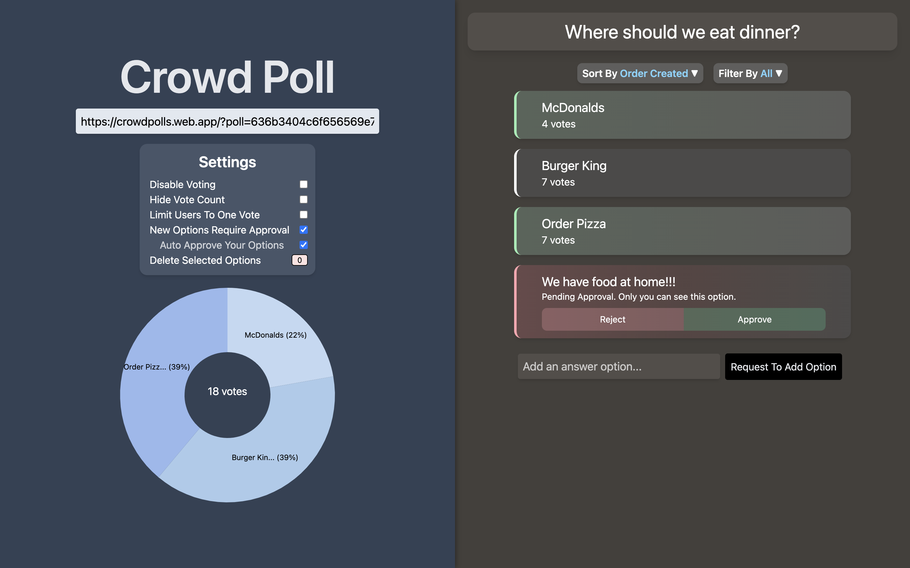
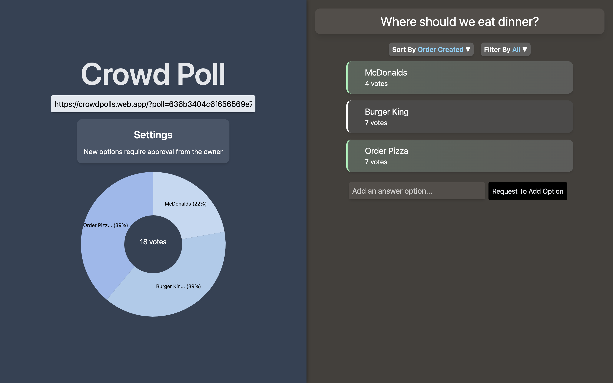

# Crowd Poll

## Description
[Crowd Poll](https://crowdpolls.web.app) is a full stack web app that allows users to generate a poll and crowd source answer options. You can view a demonstration [here](https://andrewtam.org/CrowdPoll).

Owner View                   |  User View
:---------------------------:|:-------------------------:
 | 

## Technologies
- [TypeScript](https://www.typescriptlang.org/download)
- [MongoDB](https://www.mongodb.com/try/download/community)
- [Express](https://expressjs.com/en/starter/installing.html)
- [WebSockets](https://www.npmjs.com/package/ws)
- [Node.js](https://nodejs.org/en/download/)
- [React](https://reactjs.org/docs/getting-started.html)
- [Tailwind CSS](https://tailwindcss.com/docs/guides/create-react-app)

## Installation
Clone this repository. Then, in the backend and frontend folders, update the environmental variables in .env.template (and rename it to .env).

```
git clone https://github.com/tamandrew/CrowdPoll.git
```

To run with docker, run ```docker compose up``` at the root. 
```
docker compose up
```

To run the local servers, in each of the backend and frontend folders install npm dependencies and run ```npm start``` in /frontend and /backend.

```
npm start
```
